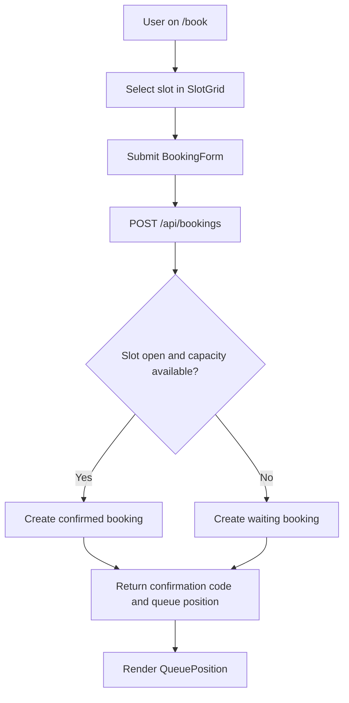
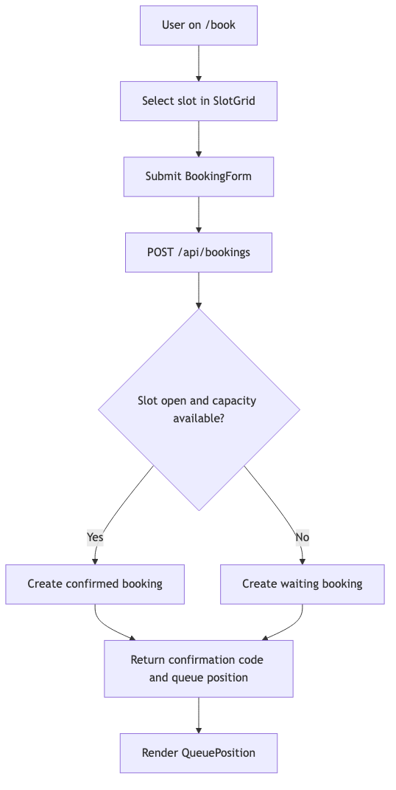
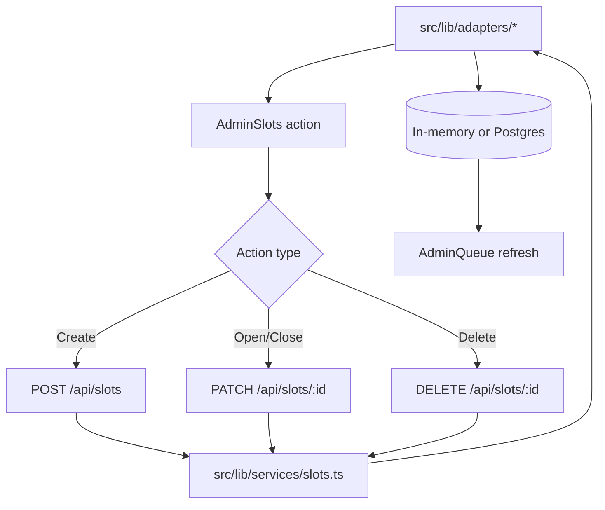
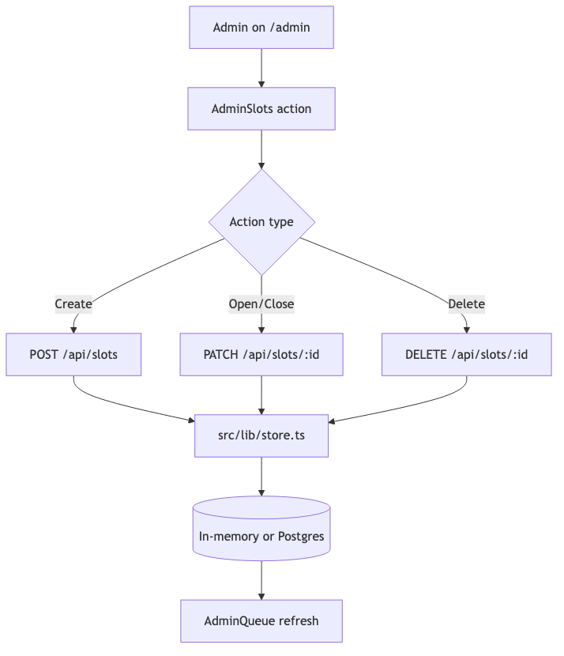
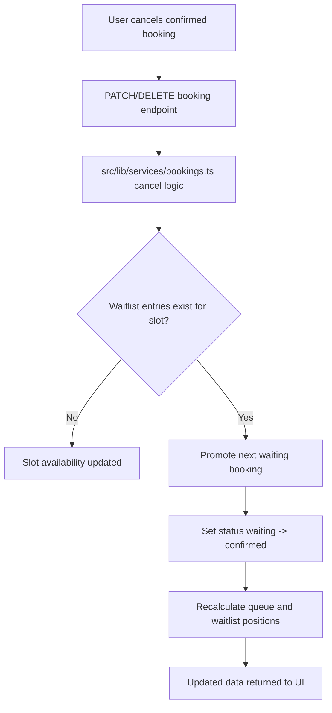
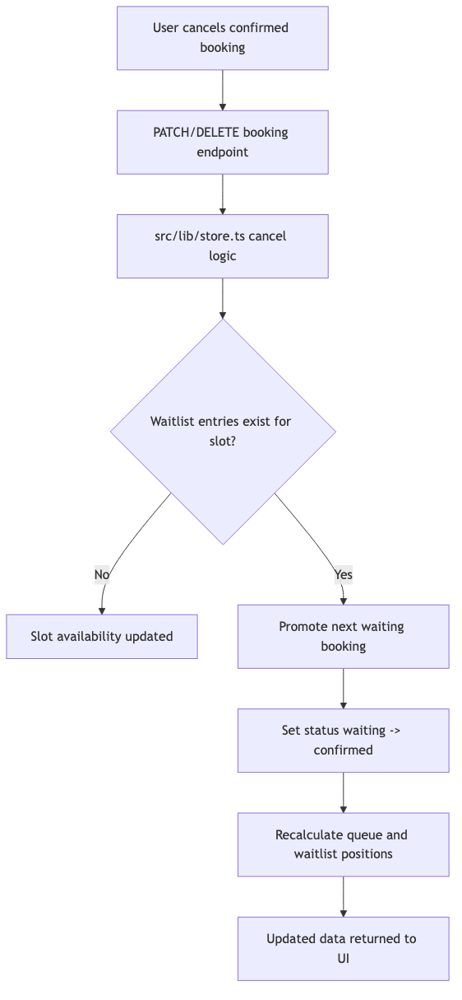

# QueueFlow Technical Document

## 1. Architecture Overview

QueueFlow is a full-stack web application built with Next.js (React, TypeScript) and supports both in-memory and Postgres-backed data storage. It uses a modular, component-driven architecture with adapter-based data access for maintainability and scalability.

---

## 2. Technology Stack

- **Frontend:** Next.js 15, React 18, TypeScript, Tailwind CSS
- **Backend:** Next.js API routes (Node.js), TypeScript
- **Database:** In-memory (default) or PostgreSQL (via `pg`)
- **Other:** ESLint, PostCSS, Lucide React (icons), date-fns, uuid

---

## 3. Directory Structure

```text
src/
├── app/           # Pages and API endpoints
│   ├── api/       # RESTful endpoints for slots, bookings, waitlist
│   ├── book/      # Booking UI
│   ├── my-spot/   # Booking status/cancel UI
│   └── admin/     # Admin dashboard
├── components/    # UI components (booking, admin, shared)
├── lib/           # Data access, business logic, DB client
├── types/         # TypeScript types/interfaces
migrations/        # SQL migration(s) for Postgres
```

---

## 4. Data Model

- **TimeSlot:** Represents a bookable slot (id, time, date, capacity, bookedCount, isOpen, duration)
- **Booking:** User booking or waitlist entry (id, confirmationCode, slotId, user info, status, queuePosition, createdAt)
- **ActivityConfig:** Activity settings (name, description, defaultCapacity, waitlistEnabled, etc.)

Types are defined in `src/types/index.ts`.

---

## 5. Data Flow

### Booking Flow

1. **User Action:** User selects a slot and submits booking info.
2. **API Call:** `POST /api/bookings` creates a booking or waitlist entry.
3. **Data Layer:** Service logic in `src/lib/services/*` uses `StoreAdapter` (`src/lib/adapters/*`) to handle slot capacity, waitlist, and booking creation.
4. **Response:** Returns booking details and queue position.





### Admin Flow

- **Slot Management:** Admin actions (add, open/close, delete) call API routes that delegate to `src/lib/services/slots.ts` via the adapter layer.
- **Live Updates:** Admin UI fetches latest bookings/slots via API.





### Waitlist Promotion Flow





### Diagram Source and Exports

- Mermaid source files: `../diagrams/src/*.mmd`
- PNG exports: `../diagrams/*.png`

---

## 6. Database Integration

- **In-Memory:** Default for local/dev, all data stored in a global object.
- **Postgres:** Enable by setting `DATABASE_URL` in `.env.local` and running migration in `migrations/001_init.sql`.
- **DB Client:** `src/lib/db.ts` provides a safe, parameterized query interface.
- **Adapter Layer:** `StoreAdapter` in `src/lib/adapters/types.ts` abstracts data access, so switching between in-memory and Postgres is seamless.

---

## 7. API Endpoints

- `GET /api/slots` — List all slots (optionally by date)
- `POST /api/slots` — Create a new slot
- `GET /api/bookings` — List bookings (admin)
- `POST /api/bookings` — Create booking or join waitlist
- `GET /api/waitlist` — Lookup booking/waitlist by confirmation code

All endpoints are implemented in `src/app/api/`.

---

## 8. UI Components

- **Booking:** `SlotGrid.tsx`, `BookingForm.tsx`, `QueuePosition.tsx`
- **Admin:** `AdminQueue.tsx`, `AdminSlots.tsx`
- **Shared:** `Nav.tsx`

All major components are documented with header and inline comments for onboarding.

---

## 9. Extensibility

- **Database:** Easily swap in other databases by implementing `StoreAdapter` and updating `src/lib/adapters/index.ts`.
- **UI:** Add new pages/components under `src/app/` and `src/components/`.
- **API:** Add new endpoints in `src/app/api/`.
- **Config:** Extend `ActivityConfig` for more settings.

---

## 10. Testing & Validation

- **Manual QA:** See `../guides/USER_GUIDE.md` for a checklist.
- **Automated Checks:** `npm test` runs build, lint, and smoke (`scripts/test-smoke.sh`). Additional integration/UI test suites can be added with Jest/RTL/Cypress/Playwright.

---

## 11. Deployment

- **Local:** `npm install && npm run dev`
- **Production:** Deploy to Vercel or any Node.js host. For Postgres, set `DATABASE_URL` and run migrations.

---

## 12. Security

- **DB:** All queries are parameterized to prevent SQL injection.
- **Admin:** Optional authentication can be added for admin routes via `ActivityConfig.adminPin` or a full auth provider.

---

## 13. Documentation

- **User Guide:** `../guides/USER_GUIDE.md`
- **Functional Spec:** `./FUNCTIONAL_DOC.md`
- **DB Setup:** `../setup/README_DB.md`
- **Diagram Exports:** `../diagrams/*.png`
- **Code Comments:** Major components and data logic contain onboarding comments.

---
